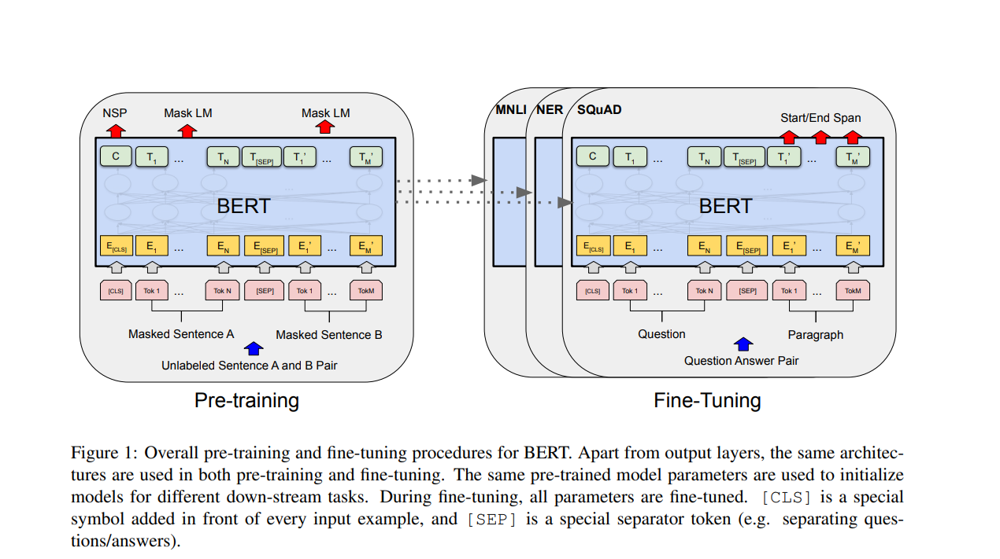
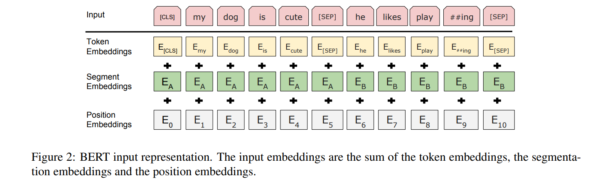
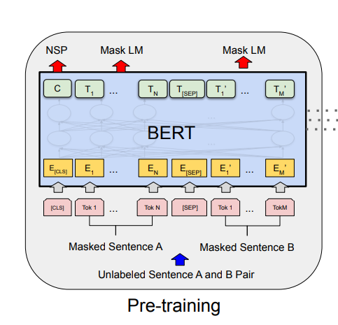

# BERT 
- BERT stands for Bidirectional Encoder Representations from Transformers. 

## Abstract

- BERT is a new language representation model. BERT is different from other models in the sense that it pretrain deep bidirectional representations by jointly conditioning  on both left and right context in all layers.

- It can be fine-tuned with additional output layer for varieties of tasks such as question answering.

## Architecture:

There are two steps in bert, they are: **Pre-training** and **fine-tuning**.

- **Pre-training:** it is the process where we train our model with unlabelled data
over different pre-training task(teaches bert foundational langauge understanding).

- **Fine-tuning:** after pre-training is done, the model is initialized with pre-trained
parameters and these parameters are fine-tuned using labelled data from downstream task(adapt
bert to solve real-world problems).

BERT's model Architecture is multi-layer bidirectional Transformer encoder based on original 
implementaion on the paper **attention is all you need**. There are two model sizes:

BERTBASE(number of layers(L)=12, Hidden Size(H)=768, number of self-attention heads(A)=12, Total parameters=110M).
BERTLARGE(L=24, H=1024, A=16, Total parameters=340M)

### Input/Output Representations:
- Bert uses **WordPiece** embeddings with a 30,000 token vocabulary.
- The first token of every sentence is always classification token i.e **[CLS]**
- As we know sentence pairs are packed into the single sequence. For exmple, **I love playing guitar**
  **I play guitar most of the time**
- There are 2 ways to differentiate it, they are:
1. Separate them with special token i.e **[SEP]**
2. Adding learned embeddings to every tokens indicating whether it belongs to sentence A or sentence B.

 

## Pre-Training in BERT:
BERT pretrains on two unsupervised task:

#### Task 1: Masked Langauge Model(MLM):
Traditional language models (LMs) are unidirectional (left-to-right or right-to-left) because bidirectional training would allow the target word to indirectly "see itself" during prediction. 

For example, in the sentence:
"The cat sat on the [MASK]."

A purely bidirectional model could trivially infer "[MASK]" as "mat" by using both left ("The cat sat on the") and right (no context here) tokens. However, 
if the model has access to the entire sequence, it might leak information about the target word itself, leading to overfitting. BERT solves this by masking tokens and 
forcing the model to rely on context.

To train a deep bidirectional model, BERT randomly masks 15% of input tokens (WordPiece tokens) and predicts them. This is inspired by the Cloze task, 
where missing words are inferred from context. Unlike denoising auto-encoders, BERT only predicts masked tokens, not the entire input.

Original sentence:
"The man went to the store to buy a gallon of milk."

After masking 15% of tokens (e.g., "went" and "gallon"):
"The man [MASK] to the store to buy a [MASK] of milk."

The model predicts "went" and "gallon" using bidirectional context.
To avoid mismatch between pre-training (where [MASK] is seen) and fine-tuning (where [MASK] is absent), BERT uses three strategies for masked tokens:

- Replace with [MASK] (80%):
"The man [MASK] to the store to buy a gallon of milk."

- Replace with a random token (10%):
"The man jumped to the store to buy a gallon of milk."

- Keep the original token (10%):
"The man went to the store to buy a gallon of milk."

The model must predict the original token ("went") regardless of replacement, forcing it to learn robust bidirectional representations.

#### Task 2: Next Sentence Prediction(NSP):
Many downstream tasks like Question Answering (QA) and Natural Language Inference (NLI) require understanding relationships between two sentences (e.g., whether one sentence logically follows another).
Standard language modeling (e.g., predicting the next word) does not explicitly teach this. NSP addresses this gap by training BERT to recognize sentence-level coherence.

##### How NSP Works
Training Data Construction:
For each example, two sentences (A and B) are selected.

- 50% of the time:
B is the actual next sentence after A (labeled IsNext).

- Example:

A: "The cat sat on the mat."
B: "It fell asleep shortly after."

- 50% of the time:
B is a random sentence from the corpus (labeled NotNext).

Example:

A: "The cat sat on the mat."
B: "The Eiffel Tower is in Paris."

- Objective:
The model predicts whether B is the true next sentence of A (IsNext/NotNext).

##### Implementation in BERT
Input Format:
Sentences A and B are concatenated and separated by the [SEP] token:

[CLS] The cat sat on the mat [SEP] It fell asleep shortly after [SEP]

Classification Token ([CLS]):

The final hidden state of the [CLS] token (position C in the original text) is used for NSP prediction.

This token aggregates sentence-level information for classification.

Training:

The [CLS] embedding is fed into a softmax classifier to predict IsNext/NotNext.

Example output:

IsNext probability: 0.9 → Correct label.

NotNext probability: 0.1.

